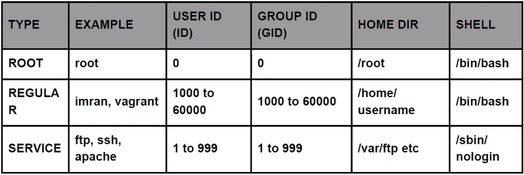
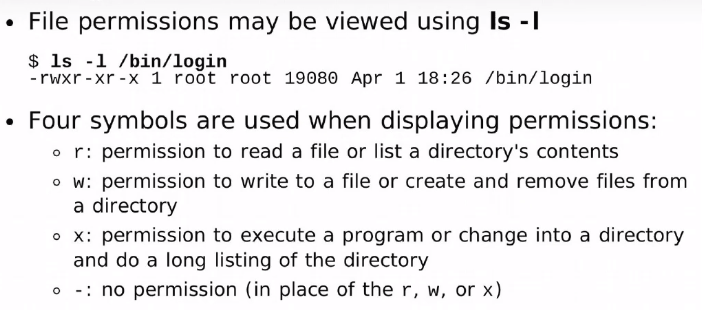

# Linux

## RHEL vs Debian
RHEL based systems are more secure than Debian ones and contain less packages. Also Debian is free and RHEL is open source and sometimes commercial.\
To install packages RHEL distros use yum and debian based use apt 

### RHEL based systems 
- Centos 
- Fedora 

### Debian based systems
- Ubuntu 
- Kali Linux 

## Commands:  
file = to check what type of file it is \
grep text_to_search file/directory = searching for a keyword in file or directory \
-i flag for being not case sensitive \
-R flag for searching in directory specified \
tail/head:
- -f flag for showing dynamic content 
- -n flag for number of lines to be retrieved

cut -d: -f1 /etc/passwd = cutting first column of a table file \
awk -F' :' ' {print $1}' /etc/passwd = same as above but using awk which is more advanced \
sed 's/coronavirus/covid19/g' filename.txt = it will replace all occurances of coronavirus in file with covid19 \
- -i flag will change it, without it it will just print the changes that would be applied 

ln -s = soft link to file  \
df -h = memory usage \
free -m =  memory usage  \
some_output >> some_file.txt = appending output to file \
some_output > some_file.txt = overwritng file if exists \
&>> appending both standard and error output \
2>> appending standar ERROR \
ls | wc -l = counting number of files \
ls | grep host = get all the files that start with name host 

## Users and groups

You can see users in directory /etc/passwd  \
You can see groups in directory /etc/group  \
User passwords are stored and encrypted in /etc/shadows directory 
### Commands
id username = retrieves data about user  \
useradd username = creates user with partricular username \
groupaadd groupname = creates groutp with particular name \
usermod -aG groupname username = adds user to a group \
passwd = change password for user \
last = info about users logins \
lsof -i username = overall info what user was doing                          \
userdel -r username = deleting user and r flag means together with directory \
groupdel = deleting groups 

## Permissions

r = read permissions
w = write permissions 
x = execute permissions 

### Commands: 
chmod = changing permissions \
chmod o-x = removing execute permissions for others \
chmod g+w = adding write permissions for group \
chown = changing ownership
visudo = modifying sudo usage permissions -> add line: "username ALL=(ALL)   NOPASSWD:ALL", to grant sudo permissions to particular user

## Files section: 
"-"  at the beginning means it's a file \
d at the beginning directory \
l - link file \
b - block disk e.g. sda 

## Vim: 
3 modes (command mode (press esc), insert mode (press i), extender mode (press :)) \
Vim makes work faster than nano and is installed usually by default unlike editors like nano 
### Commands: 
:q!  -  closing vim without saving \
:wq - save and quit \
:se nu - setting numbers \
shift + g - end of file \
gg - beginning of file \
yy - copy line \
p - paste line \
dd - delete line \
u - undo \
/ + word to search -> next occurance with letter n

